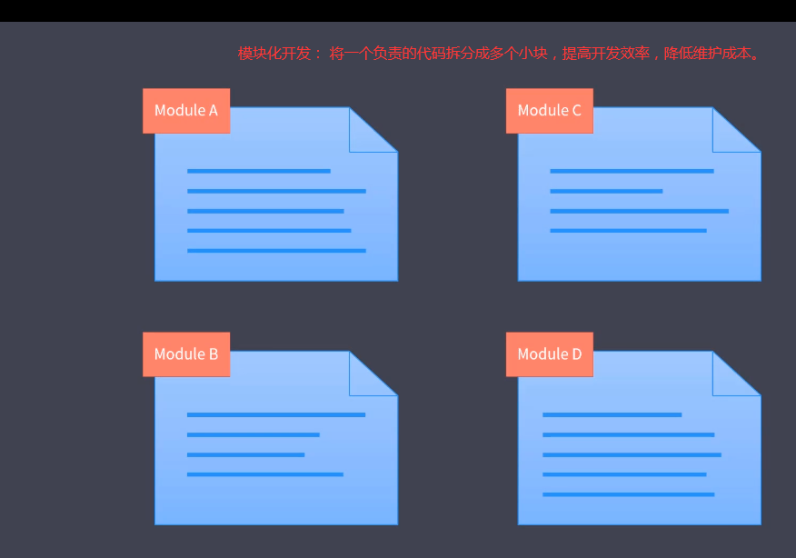
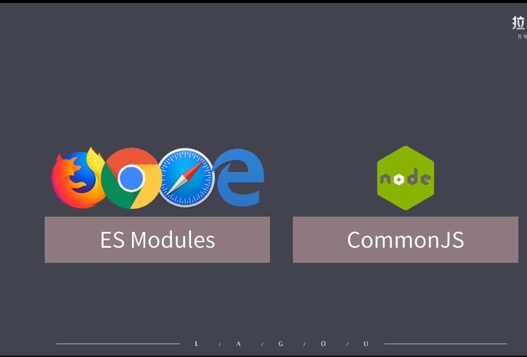

# 1. 模块化开发

模块化概述
- 他把我没复杂的代码按照功能的不同，划分为不同的模块单独去维护的这种方式提高我们的开发效率，降低维护成本。
- [模块化] 只是思想




## 1.1 模块化演变过程

基于以下几个阶段了解模块化演变过程

- Stage1： 文件划分方式

``` js
// module-a.js
var name = "a";
function work() {
    console.log(`${name} 上班`);
}
// module.b.js
var name = "b";
function work() {
    console.log(`${name} 上班`);
}
// index.html
<script src="./module-a.js"></script>
<script src="./module-b.js"></script>
// 命名冲突问题
work(); // 输出 b上班    
// 模块成员可以被修改
name = "abc";
work(); // 输出 abc上班
```
上面这种实现模块化的方式会造成以下影响
- 命名冲突问题
- 污染全局作用域
- 无法管理模块依赖关系
- 这种方式完全依靠约定

- Stage2: 命名空间方式 
    - 每个模块包裹成全局对象去实现,类似我们在模块内我们模块内的一些成员去添加了命名空间这样的感觉，这种方式成为命名空间方式
``` js
// module-a.js
var moduleA = {
    name : "a",
    work: function() {
        console.log(`${this.name} 上班`);
    }
}
// module.b.js
var moduleB = {
    name : "b",
    work: function() {
        console.log(`${this.name} 上班`);
    }
}
// index.html
<script src="./module-a.js"></script>
<script src="./module-b.js"></script>
// 减少了命名冲突问题
moduleA.work(); // 输出 a上班   
moduleB.work(); // 输出 b上班    
// 模块成员仍然可以被修改
moduleA.name = "abc";
moduleA.work(); // 输出 abc上班   
```
命名空间的方式只是减少了命名冲突问题，还是没有根本上解决上面的问题。

- State3: IIFE(立即执行函数方式)
``` js
// module-a.js
~(function () {
    var name = "a";
    function work() {
        console.log(`${name} 上班`);
    }
    window.moduleA = {
        work
    }
})();
// module.b.js
~(function () {
    var name = "b";
    function work() {
        console.log(`${name} 上班`);
    }
    window.moduleB = {
        work
    }
})();
// index.html
<script src="./module-a.js"></script>
<script src="./module-b.js"></script>
// 解决了命名冲突问题
moduleA.work(); // 输出 a上班   
moduleB.work(); // 输出 b上班    
// 模块私有成员无法访问 
console.log(moduleA.name);   // undefined
moduleA.work(); // 输出 a上班    
```


## 1.2 模块化规范
模块化标准 + 模块加载器

### 1.2.1 CommonJS 规范

- 一个文件就是一个模块
- 每个模块都有单独的作用域
- 通过 module.exports 导出成员
- 通过 require 函数载入模块

CommonJS 是以同步模式加载模块

Js如果使用CommonJS加载js会效率低下，所以早期没有使用CommonJS规范

### 1.2.2 AMD (Asynchronous Module Definition) 规范   (异步模块的定义规范)
Require.js库 实现了AMD规范

``` js
// 1. 定义一个模块
// 第一个参数是模块的名称
// 第二个参数是一个数组，声明我们这个模块依赖的项
// 第三个参数是一个函数，函数的参数和第二个参数的依赖项一一对应，每一项没依赖项导出的成员，这个函数的作用为当前这个模块提供一个私有的空间，如果你要向外部导出一些成员，可以通过 return 导出去
define("module1",["jquery","./module2"],function($, module2){
    // 返回一个对象
    return {
        start: function(){
           console.log("AMD 规范");
            $("body").append("<p>module2</p>");
            module2();
        }
    }
});
// 2. 载入一个模块
// require内部会自动创建一个script标签，去发送一个脚本的请求，并且执行相应的代码 
requrie("[./module1]",function(module1){
    module1.start();
})
```

目前绝大多数第三方库都支持 AMD 规范

AMD的缺点: 
- AMD使用起来相对复杂
    - 也就是一直重复使用define去定义模块，require去加载模块
- 模块 JS 文件请求频繁，导致页面效率低下

### 1.2.3 Sea.js (淘宝推出的) + CMD (通用模块定义规范)
``` js
// CMD 规范 (类似 CommonJS 规范)
define(function(require, exports, module){
    // 通过require 引入依赖
    var $ = require("jquery");
    // 通过 exports 或者 module.exports 对外暴露成员
    module.exports = function(){
        console.log("CMD 规范");
        $("body").append("<p>module2</p>");
    }
})
```
上面这种方式后来被require库也兼容了。  

### 1.2.4 模块化标准规范        （模块化的最佳实践）
在浏览器中使用 ES Modules(es6出的) 规范, Node.js 中使用 CommonJS 规范



## 1.3 ES Modules
### 1.3.1 基本特性

通过给 script 添加 type = module 的属性，就可以以 ES Module 的标准执行其中的 JS 代码了, 代码如下

``` js
<script type="module">
        console.log(this);
</script>
```

- 特性1： 自动采用严格模式，忽略 "use strict"
```  html
<script>
    // 非严格模式this是输出window
    console.log(this);  // 输出window
</script>
<script type="module">
    // ES Module 默认采用严格模式，this是undefined
    console.log(this);  // 输出undefined
</script>
```

- 特性2： 每个 ES Module 都是运行在单独的私有作用域中
``` html
 <script type="module">
    var age = 20;
    console.log(age);       // 输出20
</script>
<script type="module">
    console.log(age);       //  报错 age is not defined
</script>
```

- 特性3：ESC 是通过 CORS 的方式请求外部 JS 模块的  （请求的模块的服务器端必须支持跨域）     src不支持文件的路劲，必须是https://开头的路劲
``` html
 <!-- 特性3：特性3：ESC 是通过 CORS 的方式请求外部 JS 模块的 -->
<!-- 不支持 CORS 方式的会报一个跨域的错误 -->
<script type="module" src="https://libs.baidu.com/jquery/2.0.0/jquery.min.js"></script>
<!-- 支持 CORS 的可以访问，下面的就不会报错 -->
<script type="module" src="https://unpkg.com/jquery@3.4.1/dist/jquery.min.js"></script>
```

- 特性4: ESM 的 script 标签会延迟执行脚本 (等同于defer属性异步)     
    - 执行会在网页渲染之后执行

### 1.3.2 导入和导出
export 导出模块的内容
import 导入 模块的内容
``` js
// a.js
export const name = "lisi";
// 等价下面
// const name = "lisi";
// export { name };

// b.js
import {name} from "./a.js";
console.log(name);  // lisi
```

重命名

- 通过as重命名
- 通过as重命名导出的属性是default，导入的时候需要重命名成其他属性
```js
// a.js
const name = "lisi";
const age = 20;
export {

    name as default  // 将name重命名为default
    age as newAge   //  将age重命名为newAge
}
// b.js 
// 如果 export 导出的是default就必须重命名其他名称，因为default是关键字不能使用会报错
import {default as fooName,newAge} from "./a.js";
```

export.default 默认导出
- 默认导出，导入的时候名称可以随便写
``` js
// a.js
const age = 20;
export default age;
// b.js     
import xxxx from "./a.js";
console.log(xxx);       // 20
```

导出和导入的注意事项

``` js
// a.js
var name = "a";
var age = 20;
var obj = {name,age};
// 1. 导出的两种方式
// 1.1 export {} 这并不是导出一个对象，这是固定的语法
// export {name,age};  
// export 3;        // 没有这种语法，会报错
// 1.2 export default 默认导出 
export default {name,age};  // 这个才是导出对象字面量
export default obj;         // 导出obj对象变量

// 1.3 import {} 引入的时候并不是结构的形式，也是固定的语法
// b.js
import {name,age} from "./a.js";    // 会报错


// 1.4 export 导出的变量和 import 引入的变量并不是应用关系，而是完全相同的
// a.js
var name = "a";
setTiemout(()=>{
    name = "b";
},100);
function fn (){consoe.log(a);}
export default fn;
export {name}
// b.js
import fn,{name} from "./a.js";
fn();   // 输出a
setTiemout(()=>{
    fn();   // 输出b
},2000);
// 1.5 通过 import 导入的值不能更改
// name = "xxx";   // 会报错,说name是一个常量
```
综上所得：
- export导出只有两种方式    (下面两种都是固定的写法)
    - export {[变量名]}     
    - export default 默认导出的方式
- import导入的两种方式  
    - import {}            引入export {} 这种方式导出的变量
    - import a from "";     引入export default 方式导出的变量
- export 导出的变量和 import 引入的变量并不是应用关系，而是完全相同的
- 通过 import 导入的值不能更改

import 的用法
- 1. import from "" 的路劲必须是完整名，不能省略后缀名(例如:.js)       除非通过插件自动加上
- 2. 路劲可以使用 
    - ./   
    - /当前目录名称/引入的模块名称
    - cdn上完整的名称 
- 3. 只执行莫个模块，而并不是需要提取模块的成员
    - import {} from "模块名"
    - import "模块名"
- 4. 将提取的成员全部放到一个对象当中，导入的成员都会成为这个对象的属性
    - import * as mod form "模块名"
- 5. 如何动态的去加载模块
    - 不能使用 from 关键词后面不能接 变量,只能是字符串
        - import a from 变量名b     报错
    - import 只能放到最顶层，不能放到 if 关键词里面   
    - 解决上面的办法，就是动态加载模块
``` js
// 动态加载模块
const path = "./a.js";
if(true){
    import(path).then(functio(module){
        console.log(module);
    })
}
```
- 6. 同时导出命名成员和默认成员，必须遵循 import 默认成员,命名成员 from 模块名
``` js
// a. js
export {a:1};
export default 2;
// b. js
import b,{a} from "./a.js";
```

导出从模块导入的成员
``` js
// a.js
export {a:1,b:2};
export default 3;
// b.js     桥梁
export {a} from "./a.js";
export {b} from "./b.js";
export {default as c} from "./b.js";
// c.js
import {a,b,c} from "./b.js";
console.log(a,b,c);   // 1,2
```

### 1.3.2 不同环境所带来的兼容性问题
Polyfile 兼容方案

IE现在不支持ES Module       
- [兼容ESModule的polyfill] (https://unpkg.com/browse/browser-es-module-loader@0.4.1/dist/)
- [兼容promise的polyfill] (https://unpkg.com/promise-polyfill)
``` html    

 <!-- 为了兼容 ES Module 的polyfill -->
 <!-- nomodule属性代表不支持ES Module才引入的 -->
<script nomodule src="https://unpkg.com/browse/browser-es-module-loader@0.4.1/dist/babel-browser-build.js"></script>
<script nomodule
    src="https://unpkg.com/browse/browser-es-module-loader@0.4.1/dist/browser-es-module-loader.js"></script>
<script nomodule src="https://unpkg.com/promise-polyfill@8.1.3/dist/polyfill.min.js"></script>


<script type="module">
    import { name } from "./b.js";
    console.log(name);
</script>
<p>f234242</p>
```
上面这种方式只在开发阶段测试用，生产环境上不建议使用这个，因为他的原理都是在运行阶段动态的解析脚本，效率会非常差，真正我们在生产阶段预先把这些代码给他编译出来，让他可以直接在浏览器当中运行。      （使用webpack+插件实现）

## 1.3 常用的模块化打包工具

## 1.4 基于模块化工具构建现代 web 应用

## 1.5 打包工具的优化技巧