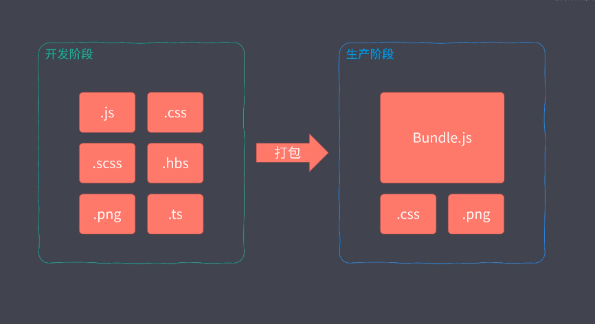

# 1. webpack 打包

[webpack 快速入门](https://www.cnblogs.com/hezihao/p/8072750.html)

> webpack 内部只支持 js 模块

模块打包工具的由来

- ES Modules 存在环境兼容问题
- 模块文件过多，网络请求频繁
- 所有的前端资源都需要模块化
- 毋容置疑，模块化是必须要的

1. 新特性代码编译： 我们需要模块化工具帮我们编译这些代码，开发阶段包含新特性的代码，直接转换为兼容环境的代码，这样一来我们面临环境兼容的问题就不存在了。  
   

2. 模块化 JavaScript 打包： 将这些模块化散落的文件打包到一起,解决了模块文件过来，网络请求频繁的问题
   

3. 支持不同类型的资源模块： 需要支持不同种类的前端资源类型，这样的话我们就可以把前端开发过程当中所涉及到的样式，图片，字体等等所以资源文件都当做模块去使用，对于我们整个应用前端来讲的话就有了统一的模块化方案
   

模块打包工具概要 (Webpack 为例)

- 模块打包器 Module bundler
  - 将零散的代码打包到一起
- 模块加载器 Loader
  - 将那些有环境兼容的代码在打包过程中通过 loader 对其进行编译转换
- 代码拆分 Code Splitting
  - 将代码按照我们的需要去打包，这样就不用担心我们把所以的代码打包到一起，产生的文件比较大的问题，我们可以把引用加载过程当中初次运行的时候所必须的模块打包到一起，对于其他的一些模块单独存放，等到应用工作实际需要到的时候我们再异步加载这个模块，从而实现增量加载或者叫渐进式加载，这样的话我们就不用担心文件太碎或者是太大这两个极端的问题。
- 资源模块 Asset Module
  - webpack 支持在 JavaScript 中以模块化方式载入任意类型的文件

模块化工具的作用：

- 打包工具解决的是前端整体的模块化，并不单指 JavaScript 模块化
- 他可以让我们在开发阶段更好的去享受模块化所带来的优势，同时不用担心模块化对生产环境所带来的影响。

## 1.1 webpack 快速上手

```js
// 1. 安装插件
yarn add webpack webpack-cli -D
// 2. 默认从项目的src的index.js入口打包，打包到dist目录中
yarn webpack
```

### 1.1.1 webpack 配置文件

webpack4.0 以后支持 0 配置打包项目，按照约定将 src/index.js -> dist/main.js 中

很多时候我们需要自定义这些路劲，这时候就需要为 webpack 项目添加 webpack.config.js 配置文件，这个文件是运行在 node.js 环境的文件，所以我们需要 module.exports 导出

```js
// webpack.config.js
const path = require("path"); // node的核心模块 path
module.exports = {
  entry: "./src/index.js", // 入口文件路劲
  // 打包目录
  output: {
    path: path.resolve(__dirname, "dist"), // 输出所在目录：绝对路劲
    filename: "index.js", // 打包之后的文件名称
  },
};
```

### 1.1.2 webpack 工作模式

mode: production 生产模式下，自动优化打包结果
mode: development 开发模式下，自动优化打包速度，添加一些调试过程中的辅助；
mode: none 模式下，运行最原始的打包，不做任何额外处理;

```js
// 1. 配置文件方式
module.exports = {
  mode: "development", // development 开发模式   production 生产模式 (默认模式:会压缩js) none 最原始的代码，不做额外的打包
};
// 2. 命令行参数
yarn webpack --mode development
```

### 1.1.3 webpack 打包运行结果

1. 打包之后的文件，整体生成的代码是一个立即执行函数,这个函数是 webpack 的工作入口，接受一个 modules 的参数，调用的时候我们传入一个数组，展开数组，数组的每一项都是一个参数列表相同的函数，这里的函数对应的是我们源代码对应的模块，也就是说我们每一个模块最终都会被包裹到这样的函数当中，从而去实现模块的私有作用域。
2. 展开这个立即执行函数

- 定义了一个对象去缓存我们加载过的模块，紧接着定义了一个 require 的函数，这个函数就是来加载模块的，再往后了就是在 require 函数挂载一些其他的数据和工具函数，这个函数执行到最后会调用 require 这个函数，传入了一个 0 开始去加载我们的模块，这个地方的模块 id 实际上就是我们上面模块数组当中的元素下标，也就是说这里才开始去加载我们源代码当中所谓的入口模块。

3. 自己 chrome 调试下 **\***

```js
(function (modules) {
  // The module cache
  var installedModules = {};
})([
  function (module, exports) {
    console.log("run webpack");
    /***/
  },
]);
```

### 1.1.4 资源模块加载


通过上面图所得，webpack 内部的 loader 只能加载 js 文件，我们如果有其他的文件就需要其他的 loader 去加载对应的文件，转换成 js 模块

loader 的作用就是将 webpack 不支持的模块转换成 js 模块

例如: css 资源模块，就需要 css-loader 把 css 转换成 js 模块，注意的是 css-loader 只有转换的功能，并不是把 css 插入到 html 页面中，我们要辅助 style-loader 将 css 插入到 html 的 style 标签中 代码如下:

```js
// 1. 需要安装 css-loader 将css模块转换成js模块
yarn add css-loader -D
// 2. 安装 style-loader 将css追加到 style标签中         (会生成injectStylesIntoStyleTag.js -> 将样式注入style标签的js)
yarn add style-loader -D
const path = require("path"); // node的核心模块 path
module.exports = {
  mode: "none ",
  entry: "./src/index.css", // 入口文件
  // 打包目录
  output: {
    path: path.resolve(__dirname, "dist"), // 绝对路劲
    filename: "index.js", // 打包之后的文件名称
  },
  // 模块
  module: {
    rules: [
      // 匹配 css 文件，并通过css-loader模块转换成js模块
      {
        test: /.css$/,
        use: ["style-loader", "css-loader"],  // 从右往左执行
      },
    ],
  },
};
```

### 1.1.5 导入模块资源

根据代码的需要动态引入资源 ，需要资源的不是你的应用，而是你的代码。 (新事物的特点才是突破)

- JavaScript 驱动整个前端应用
- 逻辑合理，JS 确实需要这些资源文件
- 确保上线资源不缺少，都是必要的

通过 import 导入模块 如下图所示：


将 js 文件作为打包入口，然后在 js 代码当中通过 import 引入其他资源文件，这样的话其他资源文件也能正常工作，我们来尝试下，如下图代码:

```js
// 1. 基于上面的安装
// header.css
.heading {
  padding: 20px;
  background: #343a40;
  color: #fff;
}
// header.js
import "./heading.css";   // 引入css文件
export default () => {
  const element = document.createElement("h2");
  element.textContent = "Hello world";
  element.classList.add("heading");
  element.addEventListener("click", () => {
    alert("Hello webpack");
  });
  return element;
};
// index.css
body {
  margin: 0 auto;
  padding: 0 20px;
  max-width: 800px;
  background: #f4f8fb;
}
// index.js
// 通过import引入js和css文件模块, 引入的模块必须是js模块，或者有对应的loader加载器去转换
import createHeading from "./heading.js";
import "./index.css";                // style-loader css-loader
const heading = createHeading();
document.body.append(heading);
// index.html中引入打包的js文件
// style-loader会自动把css模块插入到style标签中去
<script src="../dist/index.js"></script>
```

运行代码的结果如下：


通过上述所得：

- 最终打包的 index.js 文件中包含 js 打包的模块，和通过 css-loader 转换成的模块，以及 通过 style-loader 模块把 css 加入到 html 中的模块
- 必须引入 index.js 必须引入
- 必须使用 style-loader 把 css 添加到 style 标签中，不然 css 样式没效果

### 1.1.6 文件资源加载器

将文件直接拷贝到打包目录中，也需要对应的 loader 去执行

例如: 拷贝图片资源,webpack 不支持图片文件模块，所以使用 file-loader 将突破文件转换成 js 模块。 如下图所示：

- 先将导入的文件拷贝到输出的模块，然后我们的文件输出过后的文件路劲作为当前这个模块的返回值返回


```js
// 1. 安装 file-loader 加载器
yarn add file-loader
// 2. 使用文件

// index.js
import imgSrc from "./images/1.png";      // 返回的是一个文件名称
console.log(imgSrc);            // xxxxx.png
let img = new Image();
img.src = imgSrc;
document.body.append(img);

// webpack.config.js
module.exports = {
  mode: "development", // development 开发模式   production 生产模式 (默认模式:会压缩js)
  entry: "./src/index.css", // 入口文件
  // 打包目录
  output: {
    path: path.resolve(__dirname, "dist"), // 绝对路劲
    filename: "index.js", // 打包之后的文件名称
    publicPath: "../dist/", // 设置加载资源模块的公共路劲(前缀路劲)
  },
  // 模块
  module: {
    rules: [
      // 匹配图片资源，通过file-loader将图片拷贝到打包目录中
      {
        test: /\.(png|svg|jpg|gif|pdf)$/,
        use: ["file-loader"],
      },
    ],
  },
};
```

### 1.1.7 URL 加载器

Data URLs 特性的 url 协议，可以直接去表示一个文件，传统的形式需要服务器有个文件，我们通过请求这个地址得到服务器上对应的文件，而 Data URLs 是一种当前用 url 就可以表示文件内容的一种方式， 这种 url 的文本就已经包含了文件的内容，我们在使用这种这种 url 的时候不会再去发送任何的 http 请求


```js
// 1. html文件的Data URls 可以直接在网络上运行
data:text/html;charset=UTF-8,<h1>html 文件</h1>

// 2. 图片或者字体无法通过文本去表示的二进制类型的文件，可以将文件的内容进行base64编码，以base64编码过后的结果，也就是字符串去表示这个文件的内容
data:image/png;base64,iVBORw0KGgoAAAANSUhEUgAAAh4AAANaCAYAAADGfUWEAAAgAElEQVR4nOy9C7RdR3km+Nc.....
```


url-loader 的作用:

- 将小的图片使用 Data URls 的形式打包，这种方式减少 http 的请求数量
- 将大的图片还是使用 file-loader 插件拷贝到打包目录中

```js
// 1. 安装 url-loader
yarn add url-loader -D
// 2. 配置webpack.config.js
module.exports = {
  mode: "development", // development 开发模式   production 生产模式 (默认模式:会压缩js)
  entry: "./src/index.css", // 入口文件
  // 打包目录
  output: {
    path: path.resolve(__dirname, "dist"), // 绝对路劲
    filename: "index.js", // 打包之后的文件名称
    publicPath: "../dist/", // 设置加载资源模块的公共路劲(前缀路劲)
  },
  // 模块
  module: {
    rules: [
      // 匹配图片资源，通过file-loader将图片拷贝到打包目录中
      {
        test: /\.(png|svg|jpg|gif|pdf)$/,
        use: [
          {
            loader: "url-loader",
            options: {
              limit: 10 * 1024, // 10 kb 以下使用 Data URLs加载
            },
          },
        ],
      },
    ],
  },
};
```

最佳实践

- 小文件使用 Data URLs,减少请求次数 小于 10kb
- 大文件单独提取存放，提高加载速度 超出 10kb

### 1.1.8 常用加载器分类

1. 编译转换类 将加载的资源转换成 js 模块

- 例如 css-loader 将 js 文件 转换成 js 文件
  

2. 文件操作类 将加载的资源拷贝到输出目录，同时又将这个文件的访问路劲向外导出

- 例如 file-loader 将文件拷贝到打包目录，并且导出文件访问路劲
  

3. 代码检查类 对我们所加载的资源文件对代码进行校验的加载器，目的是统一我们代码的风格，从而提高代码的质量，这种加载器一般不会去修改我们生产环境的代码

- 例如 eslint 检查代码的合法性
  

### 1.1.9 webpack 与 es6

webpack 只会做模块的打包工作，因为模块打包需要，所以需要处理 import 和 exprot，并不会去转换我们代码中其他 es6 的特性

使用 babel 将 es6+的语法转换成低级语法

```js
// 1. 安装插件
yarn add babel-loader -D        // babel-loader其实是一个转换的平台
yarn add @babel/core  -D        // babel核心模块
yarn add @babel/preset-env -D   // 具体特性转换插件的集合 (包含了全部es的新特性)
// 2. 配置webpack
module.exports = {
    // 模块
  module: {
    rules: [
      {
        test: /\.js$/,
        use: {
          loader: "babel-loader",           // 使用babel-loader加载器
          options: {
            // @babel/preset-env模块将上面匹配到的js模块中的es6+语法转成低级语法
            // @babel/preset-env是plugins的集合
            presets: ["@babel/preset-env"],
            // 等价于
            // plugins: ["@"]
          },
        },
      },
    ]
  }
}
```

总结：

- webpack 只是打包工具
- 加载器可以用来编译转换代码

### 1.1.10 webpack 加载资源的方式

1.  支持 ES Modules 的 import 声明

```js
import createHeading from "./heading.js";
import "./index.css";
import imgSrc from "./images/1.png";

// 创建header结构的html
const heading = createHeading();
// 创建图片
const img = new Image();
img.src = imgSrc;
document.body.append(heading);
document.body.append(img);
```

2.  支持 CommonJS 的 require 函数

```js
const createHeading = require("./heading.js").default; // 默认导出的需要使用default属性
require("./index.css");
const imgSrc = require("./images/1.png").default;

// 创建header结构的html
const heading = createHeading();
// 创建图片
const img = new Image();
img.src = imgSrc;
document.body.append(heading);
document.body.append(img);
```

3.  支持 AMD 的 require / define 函数

```js
define(["./heading.js", "./images/1.png", "./index.css"], (
  createHeading,
  imgSrc
) => {
  // 创建header结构的html
  const heading = createHeading.default();
  // 创建图片
  const img = new Image();
  img.src = imgSrc.default;
  document.body.append(heading);
  document.body.append(img);
});

require(["./heading.js", "./images/1.png", "./index.css"], (
  createHeading,
  imgSrc
) => {
  // 创建header结构的html
  const heading = createHeading.default();
  // 创建图片
  const img = new Image();
  img.src = imgSrc.default;
  document.body.append(heading);
  document.body.append(img);
});
```

4.  部分 loader 加载的资源中一些用法也会触发资源模块加载

- 4.1 样式代码中的 @import 指令和 url 函数

```css
@import url(reset.css);
/*css-loader 同样支持 sass/less 风格的 @import 指令*/
/*@import 'reset.css';*/

body {
  min-height: 100vh;
  background: #f4f8fb;
  background-image: url(./images/background.png);
  background-size: cover;
}
```

@import 和 url 引入的文件模块会使用 module 对应的 rule 的加载器去执行，

- 例如：@import url(reset.css) 中引入的 reset.css 文件会使用 css-loader 加载器将 css 文件转换成 js 模块
- 例如：url(image) 引入的图片会使用 file-loader 将文件拷贝到打包目录，并且返回文件的路劲

- 4.2 HTML 代码中图片标签的 src
  webpack 不支持 html 模块，所以需要使用一个 loader 来将 html 模块转换成 js 模块, html-loader

```js
// 1. 安装html-loader
yarn add html-loader -D
// 2. 配置webpack
{
  test: /\.html$/,
  use: {
    loader: "html-loader",
    // html-loader默认只加载 img:src 引入的文件资源
    // 所以，你如果要使用a:href引用资源，就需要在这里配置
    attributes: {
        list: [
          {
            tag: "img",
            attribute: "src",
            type: "src",
          },
          {
            tag: "a",
            attribute: "href",
            type: "src",
          },
        ],
      }
  },
},
// 3. footer.html
<footer>
  
  <!-- <a href="./images/1.png">download png</a> -->
</footer>
// 4. index.js
import footerHtml from "./footer.html";
document.write(footerHtml);
```

运行如下图所示:


### 1.1.11 webpack 核心工作原理


webpack 会根据配置找到打包入口文件，一般情况下这个文件都会是一个 js 文件，然后他会顺着我们入口文件的代码根据代码中出现的 import 或者 require 之内的语句解析推断出来这个文件所依赖的资源模块，然后分别去解析每个资源模块对应的依赖，最后形成整个项目用到文件的依赖关系的依赖树，有了这个依赖关系的依赖树之后，webpack 会递归这个依赖树，然后找到每个节点对对应的资源文件，最后根据我们配置文件的 rule 属性去找到这个模块所对应的加载器，去交给这个加载器去加载这个模块，最后会将加载到的结果放到 build.js 也就是我们打包结果当中从而去实现我们整个项目的打包。(整个过程中 Loader 机制起到了很大的作用，因为没有 loader 的话，他就不能实现这种资源文件的加载，对于 webpack 来说他就只能算是去用来打包和合并 js 模块的工具了。)

Loader 机制是 Wepback 的核心

- 整个过程中 Loader 机制起到了很大的作用，因为没有 loader 的话，他就不能实现这种资源文件的加载，对于 webpack 来说他就只能算是去用来打包和合并 js 模块的工具了。

### 1.1.12 webpack 开发一个 loader

以创建一个解析 markdown 文件的 loader(加载器) 为例

- 默认 webpack 只识别 js 模块，所以我们要写一个 loader 去将 markdown 文件转换成导出 html 字符串的js模块

markdown-loader分析图：


实现markdown-loader的代码如下：

```js
// 1. 自定义解析markdown文件的loader
// 1.1 loader是一个函数，这个函数接受一个source源码代码的参数，并且返回对源代码操作之后的值
// markdown-loader.js
// 1.2 安装 marked 插件用来解析 markdown文件
yarn add marked -D
// loader是一个函数，这个函数接受一个source源码代码的参数，并且返回对源代码操作之后的值
const marked = require("marked"); // 将markdown文件的解析成html字符串的插件
// 这个sources就是md文件导出的内容                (# 自定义一个解析 md 文件的 loader)
module.exports = (sources) => {
  console.log("自定义loader");
  console.log("源代码内容：", sources);
  // 1. 我们需要将md文件的内容转换成js支持的语法
  const content = marked(sources); // 通过marked将markdown文件转换成html字符串
  console.log(content);
  return content; // 将html传递给下一个loader去解析
  //   return `module.exports = ${JSON.stringify(sources)}`;
  //   return `export default = ${JSON.stringify(sources)}`;
  // 这里使用JSON.stringfy解决特殊字符转义错误
  return JSON.stringify(content);
};
// 2 在webpack种配置loader
// webpack.config.js
const path = require("path"); // node的核心模块 path
module.exports = {
  mode: "development", // development 开发模式   production 生产模式 (默认模式:会压缩js)
  entry: "./src/index.js", // 入口文件
  // 打包目录
  output: {
    path: path.resolve(__dirname, "dist"), // 绝对路劲
    filename: "index.js", // 打包之后的文件名称
  },
  module: {
    rules: [
      {
        test: /\.md$/,
        // 将markdown-loader把md文件转换成html字符串，然后将html字符串交给html-loader去处理,html-loader会将html转换成js模块导出
        use: ["html-loader", "./loaders/markdown-loader"],
      },
    ],
  },
};
// 3. 运行 yarn webpack   效果如下
// 3.1 打包之前
// index.js
import note from "./note.md";
console.log(note);

// 3.2 打包过程
// 3.2.1 markdown-loader 将 note.md 文件的内容转换成html字符串
// 使用了marked插件转换
// 3.2.2 html-loader 将 html 字符串转换成js模块导出

// 3.3 打包之后的结果
eval("// Module\nvar code = \"<h1 id=\\\"自定义一个解析-md-文件的-loader\\\">自定义一个解析 md 文件的 loader</h1>\\n\";\n// Exports\nmodule.exports = code;\n\n//# sourceURL=webpack:///./src/note.md?");
```

总结：
- Loader 负责资源文件从输入到输出的转换   (管道概念)
- 对于同一个资源可以依次使用多个 Loader     (css-loader -> style-loader)


### 1.1.13 webpack 插件

plugin: 增强 webpack 自动化能力

- 清除 dist 模块
- 拷贝静态文件至输出目录
- 压缩输出代码
  loader: 专注实现资源模块加载
  plugin+loader 实现大多数前端工程化工作。（这也导致初学者都说 webpack 就是前端工程化的理解的原因，这个是不对的。）

### 1.1.13 自动清除输出目录插件

```js
// 1. 安装 clean-webpack-plugin
yarn add clean-webpack-plugin -D
// 2. 配置webpack.config.js
const { CleanWebpackPlugin } = require("clean-webpack-plugin"); // 引入清除输出目录的插件

module.exports = {
  // 插件 是在摸个时间段执行，相当于生命周期，每个插件都是一个构造函数
  plugins: [new CleanWebpackPlugin({
    dry:true
  })],
}
```

### 1.1.14 html-webpack-plugin

为什么使用 html-webpack-plugin

> 在此之前我们的 html 都是通过硬编码的方式单独存放在项目的跟目录下，这种方式有两个问题，

- 第一就是我们在项目发布时我们需要同时发布根目录下的 html 文件和 dist 目录下所有打包的结果，这样的话相对麻烦些。上线之后还要确定 html 代码中路劲引用都是正确的。
- 第二个问题是如果说我们输出的目录或者说输出的文件名也就是我们打包结果的配置发生了变化，那 html 代码当中 script 当中所引入的路劲也就需要我们手动去修改
- 以上就是硬编码存在的两个问题，这两个问题的解决办法就是通过 webpack 自动输出 html 文件

html-webpack-plugin 的作用

- 自动生成使用 bundle.js 的 html 的插件
  - 结合 webpack 自动生成我们的 html 文件，html 也参与到 webpack 的构建过程,那在构建过程中它知道它生成了多少个 bundle，自动将这些打包的 bundle 添加到我们的页面当中，一来的话我们 html 也输出到 dist 目录，上线时我们只要把 dist 输出出去就行了。二来我们 html 当中对于 bundle 的引入是动态的注入进来的，不需要我们手动的去硬编码，所以说它可以确保路劲的引入是正确的。
- HtmlWebpackPlugin 通过 html 模板生成 html 默认会将所有入口文件插入到生成的 html 中

```js
// 1. 安装html-webpack-plugin
yarn add html-webpack-plugin
// 2. 配置 webpack.config.js
module.exports = {
  plugins: [
  // 生成 index.html
  new HtmlWebpackPlugin({
    title: "首页", // 标题        注意： 不要和html-loader混合着用，不用这个title显示不了了
    // 添加meta
    meta: {
      viewport: "width=device-width",
    },
    template: "./src/index.html", // html模板路劲
    filename: "index.html", // 输出名称
  }),
  // 生成多页面应用
    new HtmlWebpackPlugin({
      title: "副页面", //  自定义标题
      // 添加meta  源数据标签
      meta: {
        viewport: "width=device-width",
      },
      template: "./src/index2.html", // html模板路劲
      filename: "index2.html", // 输出名称
    }),
],
}
// 3. index.html
<script src="打包之后的js文件路劲"></script>
```

### 1.1.15 copy-webpack-plugin

将静态资源目录拷贝到输出目录

```js
// 1. 安装copy-webpack-plugin
yarn add copy-webpack-plugin -D
// 2. 配置webpack.config.js
module.exports = {
  plugins: [
    // 把目录拷贝到输入目录
    new CopyWebpackPlugin({
      patterns: [
        {
          from: "src/public",     //  输入目录
          to: "public",     // 输出目录
        },
      ],
    }),
  ]
}
```

### 1.1.16 webpack 开发一个 plugin
相比于 Loader, Plugin 拥有更宽的能力范围,因为loader只在加载模块的环节执行去工作，而plugin工作范围几乎可以触及webpack的每一个环节。

wepbakc 的是通过钩子机制实现的。
- webpack在工作的时候会有很多环节，为了便于插件的扩展，webpack几乎给每个环节都埋下了一个钩子，那这样的话我们在开发插件的时候就可以通过往这些不同的节点上挂载不同的任务就可以轻松扩展webpack的能力，[webpack的钩子](https://webpack.js.org/api/compiler-hooks)


plugin 必须是一个函数或者是一个包含 apply 方法的对象

实现一个plugin将打包之后的js文件的注释删除掉

``` js
// 1.定义plugin
// 自定义插件
class MyPlugin {
  // options就是plugin钩子函数的实例参数
  constructor(options) {
    console.log("自定义插件构造函数options");
  }

  // compiler  配置信息的对象
  apply(compiler) {
    // 第一个参数是插件名称
    // 第二个参数compilation => 可以理解为此次打包的上下文
    compiler.hooks.emit.tap('MyPlugin', compilation => {
      // compilation => 可以理解为此次打包的上下文
      // assets 打包之后的源文件对象 main_fd12bf.js: {}
      // options webpack.config.js的配置信息
      for (const name in compilation.assets) {
        // 只解析js文件
        if (name.endsWith('.js')) {
          // key是name(文件名称)    value是文件信息，例如 source返回源文件内容的函数，size返回源文件的大小的函数
          const contents = compilation.assets[name].source()  // 获取源文件内容
          const withoutComments = contents.replace(/\/\*\*+\*\//g, '')  // 替换打包之后的开头注释
          // 将新的内容替换之前的内容
          compilation.assets[name] = {
            source: () => withoutComments,
            size: () => withoutComments.length
          }
        }
      }
    })
  }
}
// 2. 使用插件
// webpack.config.js
module.exports = {
  plugins: [
     new MyPlugin()
  ]
}
```
总结：
- webpack 的 plugin 是通过在生命周期的钩子中挂载函数实现扩展    (ast语法树)

### 1.1.17 开发体验问题


在此之前我们是编写源代码，再通过 webpack 打包，运行应用，最后刷新浏览器，周而复始的方式过于原始，如果说我们在实际的开发中还按照这样方式去使用，必然会大大减低我们的效率。

设想：理想的开发环境

- Step1: 以 http server 运行，而不是以文件的形式预览。 (webpack-dev-server)
  - 一来我们可用更接近生产环境的状态
  - 二来我们可能会需要去使用 ajax 之类的一些 api，那这些 api 文件形式去访问不被支持
- Step2: 自动编译 + 自动刷新 (webpack-dev-server 中包含 watch 的功能)
  - 修改源代码后，webpack 可用自动帮我们完成构建，然后我们的浏览器可用自动刷新及时显示最新的效果，这样的话大大减小我们开发中额外的重复操作。
- Step3：提供 Source Map 支持 (devtool:"source-map")
  - 我们运行过程中一旦出现错误，就可以根据错误的堆栈信息快速定位到源代码对应的位置，便于我们调试应用。
- 对于以上功能 webpack 都有对应的实现了。

如何增强我们 webpack 的开发体验

#### 1.1.17.1 watch-mode 实现自动编译

watch 模式的作用

- 监听文件变化，自动重新打包
- 专注编码，不要再去手动完成这些重复的工作了

```js
// 1. 监听入口文件的修改，只有入口文件修改就重新编译，类似 gulp的watch方法
// 1.1)  0配置启动监听
yarn webpack --watch
// 1.2)  也可以手动配置  webpack.config.js
module.exports = {
  // watch的配置
  watchOptions: {
    poll: 1000, // 监测修改时间(ms)
    aggregateTimeout: 500, // 防止重复按键，500毫秒内算按一次  (节流:规定时间内最后一次为准)
    ignored: /node_modules/, // 不检测node_modules里面的文件
  },
}
// 启动监听
yarn webpack --watch
```

#### 1.1.17.2 浏览器实现自动刷新

browser-sync 工具可用实现浏览器自动刷新

```js
// 1. 利用 browser-sync 开启一个静态服务器，并监听一个目录变化，只要文件变化将自动刷新
// 1.1) 全局安装 browser-sync
yarn browser-sync -g
// 1.2) 运行脚本      启动一个静态服务器，并监听服务dist目录的变化，只要dist目录变化浏览器将自动刷新
browser-sync start --server --files dist
```

运行效果如下图所示：


以上两种方式有很多弊端

- 操作上太麻烦了，要同时使用两个工具
- 开发效率上降低了，在这个过程中 webpack 会不断将文件写入磁盘，browser-sync 在从磁盘当中把它读出来，这个过程当中一次会多出两次读写操作。

### 1.1.18 dev-server

webpack-dev-server

- 提供用于开发的 http server
- 集成 自动编译(watch) 和 自动刷新浏览器(类似 browser-asyn) 等功能
- 解决了上面 watch + brower-sync 的弊端
  - 解决了操作上的麻烦，不用同时使用两个工具
  - 解决了开发效率上的问题，他会把打包的结果暂时存放在内存中，而内部的 http-server 就是从内存当中把内存中的文件读取出来然后发送给浏览器，这样可用减少很多不必要的磁盘操作，从而大大提高我们的构建效率。

```js
// 1. 安装插件
yarn add webpack-dev-server -D
// 2. 直接运行
webpack-dev-server
```

contentBase 配置额外为开发服务器指定查找静态资源目录 (**\***)

> 一般我们会把 CopyWebpackPlugin 插件留在上线前的一次打包中使用，那在平时的开发过程中我们一般不会去使用它，这是因为在开发过程中我们会频繁重复去执行打包任务，假设我们要去拷贝的文件比较多或者是比较大，如果我们没次都去执行这个插件的话，打包过程当中开销会比较大，速度自然会降低了。 代码和运行效果图如下:

```js
// 1. 安装插件
yarn add webpack-dev-server -D
// 2. 配置webpack.config.js
const CopyWebpackPlugin = require("copy-webpack-plugin"); // 拷贝目录插件
module.exports = {
  plugins: [
    // 把目录拷贝到输入目录   开发阶段最好不要使用这个插件
    new CopyWebpackPlugin({
      patterns: [
        {
          from: "src/public", //  输入目录
          to: "public", // 输出目录
        },
      ],
    }),
  ]
  // 配置开发服务器
  // devServer会将打包的dist目录存到内存中，并从内存中取
  devServer: {
    // contentBase 配置额外的静态资源路劲 配合开发服务器中不使用CopyWebpackPlugin插件
    contentBase: path.join(__dirname, "public"), // 额外的目录
    open: false, // 打开浏览器
    port: 2080, // 端口号
  },
}
```


webpack-dev-server 配置代理服务器 代码如下：

```js
// 1. 安装插件
yarn add webpack-dev-server -D
// 2. 配置webpack.config.js
const CopyWebpackPlugin = require("copy-webpack-plugin"); // 拷贝目录插件
module.exports = {
  plugins: [
    // 把目录拷贝到输入目录   开发阶段最好不要使用这个插件
    new CopyWebpackPlugin({
      patterns: [
        {
          from: "src/public", //  输入目录
          to: "public", // 输出目录
        },
      ],
    }),
  ]
  // 配置开发服务器
  // devServer会将打包的dist目录存到内存中，并从内存中取
  devServer: {
    // contentBase 配置额外的静态资源路劲 配合开发服务器中不使用CopyWebpackPlugin插件，减少devServer额外打包任务
    contentBase: path.join(__dirname, "public"), // 额外的目录
    open: false, // 打开浏览器
    port: 2080, // 端口号
    // 配置代理服务器解决跨域问题
    proxy: {
      "/api": {
        // 将带有   xxxxx/api的路劲      =>    https://api.github.com/api
        // http://localhost:2080/api/users -> https://api.github.com/api/users
        target: "https://api.github.com",
        // 最后将   /api  的路劲替换成 ""
        // http://localhost:2080/api/users -> https://api.github.com/users
        pathRewrite: {
          "^/api": "",
        },
        // 不能使用 localhost:2080 作为请求 GitHub 的主机名
        changeOrigin: true,      // http 相关的点 post (****)
      },
    },
  },
}
// 3. index.js 中使用
// // http://localhost:xxx/api/users -> https://api.github.com/users

fetch("/api/users")
  .then((res) => res.json())
  .then((res) => {
    console.log(res);
    res.forEach((item) => {
      let p = document.createElement("p");
      p.innerHTML = item.login;
      document.body.appendChild(p);
    });
});
```

### 1.1.19 source-map

通过构建编译之类的操作将开发当中的源代码转换为能在生产环境中运行的代码，这是一种进步，但是这种进步的同时意味着我们在实际当中运行的代码和我们开发阶段所编写的代码之间会有很大的差异，在这种情况下我们需要调试我们的应用，或者是运行过程中出现了错误那我们将无从下手，这是因为我们无论是调试还是报错都是基于转换过后的代码进行的，Source Map 就是解决这类问题最好的办法。

source-map 的作用

- 源代码地图 用来映射我们转换过后的代码与源代码之间的关系，一段转换过后的代码通过转换过程中生成的 source-map 文件就可用逆向得到源代码

通过源代码生成 sourcemap 文件和转换后的代码的关系如下图所示:


通过 sourcemap 文件逆向获取源代码


以 jquery 为例

```js
// 1. 引入以下文件
// jquery-3.4.1.js        源代码
// jquery-3.4.1.min.js    压缩之后的文件
// jquery-3.4.1.min.map   source-map文件
// 2. 在 jquery-3.4.1.min.js 文件最下方加入了对应的source-map文件的引用
// # sourceMappingURL=jquery-3.4.1.min.map
// 3. index.html使用压缩后的jquery文件
<body>
  <p>打开 Chrome 开发人员工具，确保开启了 Source Map 功能， 尝试断点调试</p>
  <script src="jquery-3.4.1.min.js"></script>
  <script>var $body = $(document.body); console.log($body);</script>
</body>
// 4. 在index.html打个断点就可用跳到jqeury源代码当中去
```

运行效果如下图所示:


Source Map 解决了源代码与运行代码不一致所产生的问题

### 1.1.20 webpack-source-map

配置 source-map

```js
// 1. webpack.config.js
module.exports = {
  // source-map
  devtool: {
    devtool: "source-map",
  },
};
// 2. 打包之后的目录中有个index.map文件
// index.js文件最后也会加入对应的source-map文件的引用
//# sourceMappingURL=index.js.map
// 3. 我们通过上面转换的map文件去找到源代码进行调试，通过上面的devtool:"source-map"的方式还差的远，因为webpack的devtool支持12种方式
```

webpack 支持 12 种不同的 source-map 方式

### 1.1.21 devtool-diff

以下是12中devtool模式的对比表

 

不同 devtool 模式的区别

```js
// 1.安装模块
yarn add webpack webpack-cli babel-loader @babel/core @babel/preset-env html-webpack-plugin -D

// 2. 配置webpack.config.js
const path = require("path"); // node的核心模块 path
const HtmlWebpackPlugin = require("html-webpack-plugin"); // html模板插件

// devtool的12种模块的差别
const allModes = [
  "eval",
  "cheap-eval-source-map",
  "cheap-module-eval-source-map",
  "eval-source-map",
  "cheap-source-map",
  "cheap-module-source-map",
  "inline-cheap-source-map",
  "inline-cheap-module-source-map",
  "source-map",
  "inline-source-map",
  "hidden-source-map",
  "nosources-source-map",
];

// 遍历12种模式生成12个devtool模式的配置
module.exports = allModes.map((item) => {
  return {
    mode: "none", // 不使用任何模式
    devtool: item,
    entry: "./src/index.js",
    output: {
      path: path.join(__dirname, "dist"),
      filename: `js/${item}.js`,
    },
    plugins: [
      new HtmlWebpackPlugin({
        filename: `${item}.html`,
      }),
    ],
    module: {
      rules: [
        {
          test: "/.js$/",
          use: {
            loader: "babel-loader", // 使用babel-loader
            options: {
              // @babel/preset-env 插件的集合  包含所有es6+的特性
              presets: ["@babel/preset-env"],
            },
          },
        },
      ],
    },
  };
});
// 3. 启动webpack 打包
yarn webpack
```


总结：
- eval模式：  使用eval执行模块代码 （代码执行在虚拟机的环境中）
  - 通过//# sourceURL=webpack:///./src/index.js?注释指定他所在环境，意味着可以通过sourceURL改变我们通过eval执行代码所处的环境的名称码，其实他还是运行在虚拟中，只是它告诉执行引擎我这段代码所处的文件路劲，这只是一个表示而已
  - 在这种模式下，他会将我们每个所转换过后的代码都放在eval函数当中去执行，并且在eval最后通过sourceURL去说明所对应的文件路劲，那这种的话浏览器在通过eval去执行这段代码的时候知道这段代码的源代码是哪个文件。从而去实现我们定位错误所出现的文件，只能定位文件。
  - 这种模式下，它不会去生成source-map文件，它跟source-map没有太大的关系，它的构建速度是最快的。
  - 它的效果很简单，只能定位源代码文件的名称，而不知道具体的行列信息
- cheap模式: Source-Map 是否包含行信息
- module模式： 能够得到 Loader 处理之前的源代码,  不配置module是loader处理之后的代码   
- source-map模式：  是将源代码生成一个物理文件
- inline-source-map模式：  是将source-map以dataURLs的方式嵌入到我们代码当中  (最不可能用到的)
- hidden-source-map模式：  在开发工具中是看不到source-map效果的，但是回到开发工具当中它确实生成了source-map文件，(跟jquery一样,开发第三方工具包的时候用)
- nosources-source-map模式：能看到错误出现的位置，但是我们点击这个错误信息进去是看不到源代码的，指的是没有源代码，同样给我们提供了行列信息。这为了在生产环境中不暴露源代码的情况。

选择source-map模式
- 开发模式
  - cheap-module-eval-source-map
    - cheap 只定位行就够了：  我的代码每行不会超过 80 个字符    
    - module:  我的代码经过 Loader 转换过后的差异较大
    - 首次打包速度慢无所谓，重写打包相对较快    (开发的时候大部分使用devServer)
- 生产模式
  - none  不生成source-map
    - source map 会暴露源代码
    - 调试是开发阶段的事情
  - nosources-source-map    如果你对你的代码没有信心的话
    - 出现错误的时候可以找到源代码的位置，但是不会向外暴露源代码的内容


### 1.1.22 live-reloading-issue
使用devServer开发项目 提供对开发者友好的开发服务器

弊端：
- 每次编译重新打包的时候，页面刷新，无法保存页面中的状态  （例如：编译器）

解决办法
- 办法1：代码中写死编译器的内容
- 办法2：额外代码实现刷新前保存，刷新后读取 

上述的办法，就是有洞补洞，并不能根治页面刷新导致的页面状态丢失的问题，而且这些方法都需要我们编写些跟我们业务本身无关的代码。

问题核心：自动刷新导致的页面状态丢失

更好的解决办法： 
- 页面不刷新的前提下，模块也可以及时更新

### 1.1.23 hmr-experience

hmr : Hot Module Replacement 模块热替换/热更新

热拔插： 在一个正在运行的机器上随时插拔设备，机器的运行状态不会受插拔设备的影响，而且我们插上的设备可以立即工作。例如：电脑上的USB端口可以热拔插的

模块热替换的热和热拔插是一个道理，运行过程中的即时变化


### 1.1.24 webpack-hmr 模块热更新(热替换)
为了解决devServer带来的自动刷新导致的页面状态丢失，webpack 提供了模块热更新的功能 (webpack 最大特色之一)

webpack的热替换
- 指的是引用过程中实时替换莫个模块
- 应用运行状态不受影响

热替换只将修改的模块实时替换至应用中，解决了自动刷新导致的页面状态丢失

HMR 是 Webpack 中最强大的功能之一
- 极大程度的提高了开发者的工作效率

Webpack 开启 HMR
``` js
// 1. 在devServer中开启热更新
module.exports = {
  // 配置开发服务器
  devServer: {
    hot: true, // 开启热更新模块
  },
  plugins: [
    new require("webpack").HotModuleReplacementPlugin()
  ]
};
// 1.2 修改对应的模块看会不会热替换模块
// 1.2.1) 修改css模块: style-loader 内部自动处理更新样式，所以不需要手动处理样式模块

// 1.2.2) 修改js模块  页面自动刷新了，没有热替换的功能
// 使用 HMR APIs  去手动处理模块更新过后的热替换
import "./index.css";
import background from "./better.png";
import createEle from "./createEle.js";

console.log("devServer自动刷新导致的页面状态丢失");

let ele = createEle();
document.body.appendChild(ele);

const img = new Image();
img.src = background;
document.body.appendChild(img);

// ================================================================
// HMR 手动处理模块热更新
// 不用担心这些代码在生产环境冗余的问题，因为通过 webpack 打包后，
// 这些代码全部会被移除，这些只是开发阶段用到
if (module.hot) {
    console.log("启动了热更新功能 使用 HMR APIs 手动处理模块的热更新");
    let hotEditor = ele
    // 这个只针对createEle.js模块
    module.hot.accept('./createEle.js', () => {
        // 当 editor.js 更新，自动执行此函数
        // 1. 临时记录编辑器内容
        const value = hotEditor.innerHTML
        // 2. 移除更新前的元素
        document.body.removeChild(hotEditor)
        // 3. 创建新的编辑器
        //    此时 createEle 已经是更新过后的函数了
        hotEditor = createEle()
        // 4 还原编辑器内容
        hotEditor.innerHTML = value
        // 5 追加到页面
        document.body.appendChild(hotEditor)
    })
}


// 1.2.3) 修改图片
module.hot && (module.hot.accept('./better.png', () => {
      // 当 better.png 更新后执行
      // 重写设置 src 会触发图片元素重新加载，从而局部更新图片
      img.src = background
}));

```
综上所得：
- Webpack 中的 HMR 并不可以开箱即用
- Webpack 中的 HMR 需要手动处理模块热替换逻辑

问题1： 为什么样式文件的热更新开箱即用？
- style-loader 内部自动处理更新样式，所以不需要手动处理样式模块


问题2：凭什么样式可以自动处理？脚本文件需要我们手动处理了？
- 因为样式模块更新之后只要把更新过后的css即时替换到页面当中它就可以覆盖掉之前的样式。从而实现样式文件的更新。
- 而我们所编写的js模块，他是没有任何规律的，因为你可能在模块中导出的是一个对象，有可能导出的是一个字符串，还有可能导出的是一个函数，那我们对导出的成员的使用各不相同的，所以说webpack对这些毫无规律的js模块他就根本不知道如何去处理你更新之后的模块，那就没有办法帮你实现一个通用型的模块替换方案。
  
问题3： 我们项目没有手动处理，JS照样可以热替换
- 这是因为你使用了莫个框架
- 框架下的开发，每种文件都是有规律的
- 通过脚手架创建的项目内部都集成了HMR方案

总结：我们需要手动处理 JS 模块更新后的热替换


Webpack HMR 注意事项：
1. 处理HMR的代码报错会导致自动刷新
    > 使用hot的方式，如果热替换失败，那他就会自动回退去使用自动刷新这样的一个功能，而hotOnly不会使用自动刷新。
```js
module.exports = {
  devServer:{
    // hot: true,
    hotOnly: true
  }
}
```
2. 没启用HMR的情况下，HMR API 报错
``` js
// 在这里判断下就可以了
if(module.hot){
  // 不用担心这些代码在生产环境冗余的问题，因为通过 webpack 打包后，
  // 这些代码全部会被移除，这些只是开发阶段用到
}
```

### 1.1.25 production-config
生产环境和开发环境有很大的差异
- 生产环境注重运行效率      更小量，更高效的代码去完成业务功能。
- 开发环境注重开发效率    
webpack 建议我们为不同的工作环境创建不同的配置，以便于我们打包的结果使用于不同的环境。


不同环境下的配置
1. 配置文件根据环境不同导出不同配置
``` js
// 1. webpack.config.js 中的配置
const path = require("path"); // node的核心模块 path

const { CleanWebpackPlugin } = require("clean-webpack-plugin"); // 引入清除输出目录的插件
const HtmlWebpackPlugin = require("html-webpack-plugin"); // html模板插件
const CopyWebpackPlugin = require("copy-webpack-plugin"); // 用来拷贝静态资源目录
const webpack = require("webpack");

// 1. 配置文件根据环境不同导出不同配置
// env 运行cli传递的环境参数
// argv 运行cli传递的所有参数
module.exports = (env, argv) => {
  // 1.1 开发环境的配置
  const devConfig = {
    mode: "none", // development 开发模式   production 生产模式 (默认模式:会压缩js)   none 源代码模式
    entry: "./src/index.js", // 入口文件
    // 打包目录
    output: {
      path: path.resolve(__dirname, "dist"), // 绝对路劲
      filename: "index.js", // 打包之后的文件名称
      // publicPath: "dist/", // 设置加载资源模块的公共路劲(前缀路劲)
    },
    // 模块
    module: {
      rules: [
        {
          test: /\.js$/,
          use: {
            loader: "babel-loader",
            options: {
              presets: ["@babel/preset-env"],
            },
          },
        },

        // 匹配 css 文件，并通过css-loader模块转换成js模块
        {
          test: /\.css$/,
          use: ["style-loader", "css-loader"],
        },
        // 匹配图片资源，通过file-loader将图片拷贝到打包目录中
        {
          test: /\.(png|svg|jpg|gif|pdf)$/,
          use: ["file-loader"],
        },
      ],
    },
    // 插件
    plugins: [
      // HtmlWebpackPlugin 通过html模板生成html  默认会将所有入口文件插入到生成的html中
      new HtmlWebpackPlugin({
        title: "首页", // 标题
        // 添加meta
        meta: {
          viewport: "width=device-width",
        },
        template: "./src/index.html", // html模块路劲
        filename: "index.html", // 输出名称
      }),
      new webpack.HotModuleReplacementPlugin()
    ],
    // 配置开发服务器
    devServer: {
      hot: true,
      // hotOnly: true
    },
    // source-map eval
    devtool: "source-map",
  };

  // 1.2 生产环境的配置
  if (env === "production") {
    devConfig.mode = "production";    // 生产环境mode
    devConfig.devtool = false;   // 禁用掉source map
    devConfig.plugins = [
      ...devConfig.plugins,
      new CleanWebpackPlugin(),
      // 开发环境中，在devServer中的contentBase中配置静态目录public，
      // 开发的时候不参与打包，提高编译速度，
      // 生产环境时使用此插件拷贝静态资源目录到打包目录
      new CopyWebpackPlugin({
        patterns: [
          {
            from: "src/public", //  输入目录
            to: "public", // 输出目录
          },
        ],
      })
    ]
  }
  return devConfig;
}
// 2. package.json中的配置
"scripts": {
  "build": "webpack",   // 开发环境模式的打包
  "build-pro": "webpack --env production",  // 生产环境模式打包
  "dev": "webpack-dev-server"     // 开发环境
}
```

2. 一个环境对应一个配置文件   (多配置方式)
- 一个公共的配置  (开发，生产都需要的)
- 一个开发独有的配置
- 一个生产独有的配置
- 具体配置如下代码 1.1.26 merge-config


### 1.1.26 merge-config
使用merge-config配置一个环境对应一个配置文件
``` js
// 1. webpack.common.js
const path = require("path"); // node的核心模块 path
const HtmlWebpackPlugin = require("html-webpack-plugin"); // html模板插件
// 1. webpack的公共配置
module.exports = {
  entry: "./src/index.js", // 入口文件
  // 打包目录
  output: {
    path: path.resolve(__dirname, "dist"), // 绝对路劲
    filename: "index.js", // 打包之后的文件名称
    // publicPath: "dist/", // 设置加载资源模块的公共路劲(前缀路劲)
  },
  // 模块
  module: {
    rules: [
      {
        test: /\.js$/,
        use: {
          loader: "babel-loader",
          options: {
            presets: ["@babel/preset-env"],
          },
        },
      },

      // 匹配 css 文件，并通过css-loader模块转换成js模块
      {
        test: /\.css$/,
        use: ["style-loader", "css-loader"],
      },
      // 匹配图片资源，通过file-loader将图片拷贝到打包目录中
      {
        test: /\.(png|svg|jpg|gif|pdf)$/,
        use: ["file-loader"],
      },
    ],
  },
  // 插件
  plugins: [
    // HtmlWebpackPlugin 通过html模板生成html  默认会将所有入口文件插入到生成的html中
    new HtmlWebpackPlugin({
      title: "首页", // 标题
      // 添加meta
      meta: {
        viewport: "width=device-width",
      },
      template: "./src/index.html", // html模块路劲
      filename: "index.html", // 输出名称
    }),
  ],
};

// 2. webpack.dev.js
const common = require("./webpack.common"); // 导入公共配置
const webpack = require("webpack"); // 引入webpack插件
const { merge } = require("webpack-merge"); // 合并webpack配置
// 2. webpack的开发环境配置
// 在这里使用object.assign({},common,{})  不合适，他会把之前的plugins会覆盖掉
module.exports = merge(common, {
  mode: "none",
  devtool: "source-map",
  // 配置开发服务器
  devServer: {
    hot: true // 启动热更新
  },
  plugins: [
    new webpack.HotModuleReplacementPlugin()  // 使用热更新插件
  ]
});
// 3. webpack.prod.js
const common = require("./webpack.common"); // 导入公共配置
const webpack = require("webpack"); // 引入webpack插件
const { CleanWebpackPlugin } = require("clean-webpack-plugin"); // 引入清除目录的插件
const CopyWebpackPlugin = require("copy-webpack-plugin"); // 引入拷贝目录的插件
const { merge } = require("webpack-merge"); // 合并webpack配置
// 3. webpack的生产环境配置
module.exports = merge(common, {
  mode: "production",   // 生产环境模式
  devtool: "none",      // 关闭 source map
  plugins: [
    new CleanWebpackPlugin(), // 清空打包目录
    new CopyWebpackPlugin({
      patterns: [
        {
          from: "src/public", //  输入目录
          to: "public", // 输出目录
        },
      ],
    })
  ]
});
// 4. package.json
"scripts": {
  "build": "webpack --config webpack.prod.js",      // 生产环境打包
  "dev": "webpack-dev-server --config webpack.dev.js"   // 开发环境调试
}
``` 

### 1.1.27 define-plugin  定义全局变量     (优化配置1)
 
webpack 自带的插件，定义全局变量

```js
// 1. 配置 webpack.config.js
const path = require("path"); // node的核心模块 path
const webpack = require("webpack"); // webpack自带的插件
module.exports = {
  mode: "none", // development 开发模式   production 生产模式 (默认模式:会压缩js)
  entry: "./src/index.js", // 入口文件
  // 打包目录
  output: {
    path: path.resolve(__dirname, "dist"), // 绝对路劲
    filename: "index.js", // 打包之后的文件名称
    // publicPath: "dist/", // 设置加载资源模块的公共路劲(前缀路劲)
  },
  plugins: [
    new webpack.DefinePlugin({
      // 注意打包之后变量就不存在了，他把我们注入成员的值直接替换到代码当中。
      // 值要求的是一个代码片段   可以用来设置环境变量    
      API_BASE_URL: JSON.stringify("https://api.example.com"),
      // process.env 命令行中设置的参数
      NODE_ENV: JSON.stringify(process.env.NODE_ENV),
      BUILD_ENV: JSON.stringify(process.env.BUILD_ENV),
      VERSION: new Date().getTime(), //版本号
    }),
  ],
};
// 2. 在pack.json中配置
// 安装 yarn add cross-env -D
{
  "scripts": {
    "build": "cross-env NODE_ENV=build BUILD_ENV=sit webpack",
  }
}
// 3. 在模块中使用
// index.js
console.log(API_BASE_URL); // https://api.example.com
console.log(NODE_ENV);
console.log(BUILD_ENV);

```

### 1.1.28 tree-shaking 树摇晃    (优化配置2)

tree-shaking 摇掉代码中未引用部分
- 未引用代码 (dead-code)

``` js
// 1. common.js
// 导出add方法
export const add = (a, b) => {
    console.log("执行add方法");
    return a + b;
    console.log("未引用代码");
}
// 导出minus方法
export const minus = (a, b) => {
    console.log("执行minus方法");
    return a - b;
    console.log("未引用代码");
}
// 2. index.js
import { add } from "./common";
// import { add } from "./common"; 这种方式引入的 
// tree shaking 会将common.js中未用到的代码剔除掉
console.log(add(1, 2));
// 3. package.json
"scripts": {
  "build": "webpack --mode production",   // tree shaking 在生产模式下会自动开启
  "none": "webpack --mode none" // 不会开启 tree shaking
}
// 4. 执行 yarn build
// index.js中未引入的common.js中的代码会剔除掉

// 5. 执行 yarn none
// index.js中引入的common.js中的代码不会剔除掉
```

执行yarn build的结果图  (tree shaking)
 
执行yarn none的效果图   (no tree shaking)
 

Tree Shaking
- Tree Shaking 不是指莫个配置选项
- 是一组功能搭配使用后的优化效果

生成环境下会自动启用 （mode为production） 

使用none模式怎么开启 tree shaking  (手动开启tree shaking)
- usedExports 负责标记 枯树叶
- minimize 负责 摇掉 它们
``` js
// 1. webpack.config.js
module.exports = {
   // 配置优化项
  optimization: {
    // mode为production会自动开启以下两个配置
    usedExports: true,   // 只导出外部使用的成员
    minimize: true    // 开启代码压缩功能，压缩没有使用过的代码
  },
}
```


### 1.1.29 concatenateModules 尽可能将多个模块合并到一个函数中  (优化配置3)

concatenateModules的作用  
- 尽可能的将所有模块合并输出到一个函数中,既提升了运行效率，又减少了代码的体积

``` js
// webpack.config.js 配置
module.exports = {
  optimization: {
    // 尽可能的将所有模块合并输出到一个函数中,既提升了运行效率，又减少了代码的体积  (Scope Hoisting 作用域提升)
    concatenateModules: true,  
  },
}
```

### 1.1.30 tree-shaking-babel   (面试，扩展)
Tree Shaking 前提是 ES Modules 组织我们的代码 
- 也就是 import {xx} from "模块"
- 由 Webpack 打包的代码必须使用 ESM

为了转换代码中的 ECMAScript 新特性 很多使用会使用  babel-loader 处理我们的js
- babel 可能会 将 ES Modules -> CommonJS  (取决于有没有转化成CommonJS的插件)
- @babel/preset-env就有这么一个插件，将ES Modules -> CommonJS
- @babel/preset-env最新的版本已经禁用掉将ES Modules -> CommonJS的功能了
- 为了测试，我们这里强制将@babel/preset-env设置我们的代码转换成commonjs
``` js
module.exports = {
  module: {
    rules: [
      {
        test: /\.js$/,
        use: {
          loader: 'babel-loader',
          options: {
          presets: [
              // 强制将@babel/preset-env设置将我们的代码转换成commonjs
              // 如果 Babel 加载模块时已经转换了 ESM，则会导致 Tree Shaking 失效
              // ['@babel/preset-env', { modules: 'commonjs' }]
              // ['@babel/preset-env', { modules: false }]
              // 也可以使用默认配置，也就是 auto，这样 babel-loader 会自动关闭 ESM 转换
              // 为了确保不会转换成commonjs，导致tree shkaing失效，在这里设置modules:false
              ['@babel/preset-env', { modules: 'commonjs' }]
            ]
          }
        },
      },
    ],
  },
  // 配置优化项
  optimization: {
    // 只导出外部使用的成员
    usedExports: true,            
    // 开启代码压缩功能，压缩没有使用过的代码
    // minimize: true
    // 尽可能的将所有模块合并输出到一个函数中,既提升了运行效率
    // concatenateModules: true, 
  },
}
```
- 将@babel/preset-env设置我们的代码转换成commonjs之后我们usedExports就失效了。 即便我们开启 minimize: true 压缩代码，tree shaking也失效了。

综上所述：
- Tree Shaking 前提是 ES Modules 组织我们的代码 ，不然 Tree Shaking就会失效


### 1.1.31 side-effects  副作用 (优化配置4)
副作用： 模块执行时除了导出成员之外所做的事情
- 一般用于 npm 包标记是否有副作用

``` js
// 1. add.js
// 导出add方法
export const add = (a, b) => {
    console.log("执行add方法");
    return a + b;
    console.log("未引用代码");
}
// 2. minus.js
//  导出minus方法
export const minus = (a, b) => {
    console.log("执行minus方法");
    return a - b;
    console.log("未引用代码");
}
// 3. commons/index.js
// 集中导出，便于外界导入，常见的同类文件组织方式。
export { add } from "./add";
export { minus } from "./minus";
// 4. index.js
import { add } from "./commons";
// 会出现一个问题 
// 因为我们在这载入的是commons下的index.js，index.js中又载入了所有的组件模块
// 这就会导致我们只想载入的add组件，但是所有的组件都会被加载执行。
// side-effects副作用就可以解决此类问题
console.log(add(1, 2));

// 5.webpack.config.js
module.exports = {
   // 配置优化项
  optimization: {
    sideEffects: true,    // 开启这个特性 production模式下会自动开启   
    // 只导出外部使用的成员   production模式下会自动开启
    usedExports: true,
    // 开启代码压缩功能，压缩没有使用过的代码   production模式下会自动开启
    // minimize: true
    // 尽可能的将所有模块合并输出到一个函数中,既提升了运行效率
    // concatenateModules: true, 
  },
}
// 6. package.json
"sideEffects": false    // 代表我们的代码是没有副作用
// 7. yarn none
// 会把index.js中引入的common/index.js中没有引入的副作用移除掉

// 8. 副作用代码    
// 为 Number 的原型添加一个扩展方法 
Number.prototype.pad = function (size) {
    let result = this + "";
    while (result.length < size) {
        result = "0" + result;
    }
    return result;
}
// import "./extends";
// 因为这个模块没有到处任何成员，所以不要提取任何成员
// 引入这个文件的时候没有引用pad方法，他是定义在Number原型上的
// 像这种为Number做扩展的操作就属于extends模块的副作用
// 因为在导入模块的时候会为number添加一个方法
// 那此时我们还标识项目中的代码没有副作用的话，那上面这个副作用的代码将不会被打包进去
// 9. index.js
import "./extends"; // 都是副作用模块
import "./style";   // 都是副作用模块
// 10. 解决上面的办法是 
// 10.1 在package.json 中关闭  sideEffects:true
// 10.2 在package.json 中标识哪些模块有副作用的，这样webpack打包的时候就不会忽略这些有副作用的模块   
// package.json
"sideEffects": [
    "./src/extends.js",
    "*.css"
]
```

Webpack sideEffects 注意
- 确保你的代码真的没有副作用    
``` js
// 1. webpack.config.js
module.exports = {
  optimization: {
    sideEffects: true,    // 开启这个特性 production模式下会自动开启   
  },
}
// 2. pacage.json
"sideEffects": false    // 把所有的副作用都剔除掉，不打包到项目中
```
- 如果你的代码有副作用，并且这些副作用用的到的，例如 css文件,那就设置如下方式
```js
// 1. webpack.config.js
module.exports = {
  optimization: {
    sideEffects: true,    // 开启这个特性 production模式下会自动开启   
  },
}
// 2. pacage.json
"sideEffects": [        // 以下这些模块的副作用会被打包进去，不会剔除掉
    "./src/extends.js",
    "*.css"
]
```

### 1.1.32 multiple-entry   多入口打包  
多入口打包
- 多页引用程序
  - entry 为对象形式
- 一个页面对应一个打包入口
  - 使用chunks指定打包入口
``` js
const path = require("path"); // node的核心模块 path
const HtmlWebpackPlugin = require("html-webpack-plugin"); // html模板插件

module.exports = {
  mode: "none", // none 源代码模式
  entry: {    // 入口文件
    index: "./src/index.js",
    about: "./src/about.js"
  },
  // 打包目录
  output: {
    path: path.resolve(__dirname, "dist"), // 绝对路劲
    filename: "[name].js", // 打包之后的文件名称
  },
  // 模块
  module: {
    rules: [
      // 匹配 css 文件，并通过css-loader模块转换成js模块
      {
        test: /\.css$/,
        use: ["style-loader", "css-loader"],
      },
    ],
  },
  // 插件
  plugins: [
    // HtmlWebpackPlugin 通过html模板生成html  默认会将所有入口文件插入到生成的html中
    new HtmlWebpackPlugin({
      title: "首页", // 标题
      template: "./src/index.html", // html模块路劲
      filename: "index.html", // 输出名称
      chunks: ["index"]     // 默认是将所有的打包js引入，可以指定你需要的入口js文件
    }),
    new HtmlWebpackPlugin({
      title: "about", // 标题
      template: "./src/about.html", // html模块路劲
      filename: "about.html", // 输出名称
      chunks: ["about"] // 默认是将所有的打包js引入，可以指定你需要的入口js文件
    }),
  ],
};
```

### 1.1.33 split-chunks 代码分隔  (优化配置5)
多入口打包，不同入口中肯定会有公共模块

例如下面两个文件都引入了global.css
``` js
// index.js
import "./global.css";
import "./index.css";
// about.js
import "./global.css";
import "./about.css";
// 使用optimization提取模块的公共部分
module.exports = {
  // 配置优化项
  optimization: {
    // 分隔模块的配置
    splitChunks: {
      chunks: "all"   // 提取所有模块的公共部分
    }
  }
}
// 最后使用yarn build
// 打包之后的文件会多生成一个文件存取公共部分
```

### 1.1.34 dynamic-import 按需加载   (优化配置6)
按需加载
- 需要用到莫个模块时，再加载这个模块
- 极大减少了我们的带宽和流量 

webpack 支持动态导入的方式实现按需加载

所有动态导入的模块会被自动分包

``` js
// index.js
// import posts from './posts/posts'            // 这是静态导入
// 动态导入
import(/* webpackChunkName: 'components' */'./posts/posts').then(({ default: posts }) => {
    mainElement.appendChild(posts())
})
```

如果你使用的是单页引用开发框架，比如vue,react，那在你项目中的路由映射组件可以通过这种动态导入的方式实现按需加载。

魔法注释  
- 给分包产生的bundle文件起名字
- /* webpackChunkName: 'components' */
- 如果你导入导入的chunk是一样的就可以设置同一个注释名，他就会打包到一起了。
``` js
// 1. 分包打bundle
/* webpackChunkName: 'commponent1' */
/* webpackChunkName: 'commponent2' */
// 打包之后的文件: commponent1,commponent2,commponent1~commponent2

// 2. 将分包打的bundle放一起
/* webpackChunkName: 'commponent' */
/* webpackChunkName: 'commponent' */
// 打包之后的文件: commponents
```

### 1.1.35 mini-css-extract-plugin  提取CSS到单个文件   (优化配置7)

提取CSS到单个文件
``` js
// webpack.config.js
const path = require("path"); // node的核心模块 path

const { CleanWebpackPlugin } = require("clean-webpack-plugin"); // 引入清除输出目录的插件
const HtmlWebpackPlugin = require("html-webpack-plugin"); // html模板插件
const MiniCssExtractPlugin = require("mini-css-extract-plugin"); // 提取css文件到一个单独的文件当中

module.exports = {
  mode: "none", // 源代码模式
  entry: "./src/index.js", // 入口文件
  // 打包目录
  output: {
    path: path.resolve(__dirname, "dist"), // 绝对路劲
    filename: "index.js", // 打包之后的文件名称
  },
  // 模块
  module: {
    rules: [
      // 匹配 css 文件，并通过css-loader模块转换成js模块
      {
        test: /\.css$/,
        use: [
          // "style-loader",   // 将样式通过style标签注入    开发模式用
          MiniCssExtractPlugin.loader,  // 将样式通过link标签注入 生产环境用
          "css-loader"
        ],
      },
    ],
  },
  // 插件
  plugins: [
    new CleanWebpackPlugin(),
    // HtmlWebpackPlugin 通过html模板生成html  默认会将所有入口文件插入到生成的html中
    new HtmlWebpackPlugin({
      title: "首页", // 标题
      template: "./src/index.html", // html模块路劲
      filename: "index.html", // 输出名称
    }),
    new MiniCssExtractPlugin()
  ],
};
```

当css文件大于150kb才需要考虑是否将他提取到单独的文件当中，否则的话其实css嵌入到代码当中它减少一次请求效果可能会更好

### 1.1.37 optimize-css-assets-webpack-plugin 压缩css文件  (优化配置8)

webpack的production模式默认只压缩js文件，我们要压缩css需要单独的插件

``` js
// 1. 安装插件
yarn add optimize-css-assets-webpack-plugin -D
// 2. webpack.config.js
const OptimizeCssAssetsWebpackPlugin = require("optimize-css-assets-webpack-plugin");  // 压缩css的插件

module.exports = {
  // 优化项配置
  optimization: {
    // webpack建议将这种压缩内的插件配置在minimizer当中，以便于我们通过minimizer这个选项去统一控制
    minimizer: [
      new OptimizeCssAssetsWebpackPlugin()
    ]
  }
}
```

一般会配置在minimizer而不是配置在plugins中，为什么？
- 如果配置在plugins数组中，这个插件在任何情况下都会正常工作
- 配置在minimizer当中的话只会在minimizer的特性开启时才会工作
- webpack建议将这种压缩内的插件配置在minimizer当中，以便于我们通过minimizer这个选项去统一控制

如果配置了minimizer这个数组，要自定义所使用的压缩插件，内部的js压缩器就会被覆盖掉，不会压缩js了
- 我们需要手动配置压缩js的插件
``` js
// 1. 安装插件
yarn add terser-webpack-plugin -D
// 2. webpack.config.js
const TerserWebpackPlugin = require("terser-webpack-plugin");  // 压缩js的插件

module.exports = {
  // 优化项配置
  optimization: {
    // webpack建议将这种压缩内的插件配置在minimizer当中，以便于我们通过minimizer这个选项去统一控制
    minimizer: [
      new OptimizeCssAssetsWebpackPlugin(),
      new TerserWebpackPlugin()
    ]
  }
}
```

### 1.1.38  输出文件名 Hash  
生成模式下，文件名使用 Hash 防止缓存

hash的3种声明方式
``` js
// 1. hash 项目级别的   只要项目任意改动，hash都会改变
{
  filename: "[name]-[hahs:8]"   // 项目级别的
}
// 2. chunkhash     同一个chunk的hash才会改变   解决缓存的最好方式
{
  filename: "[name]-[chunkhash:8]"   // chunk级别的
}
// 3. contenthash     不同的文件会有不同的hash值
{
  filename: "[name]-[contenthash:len]"   // chunk级别的
}
```


